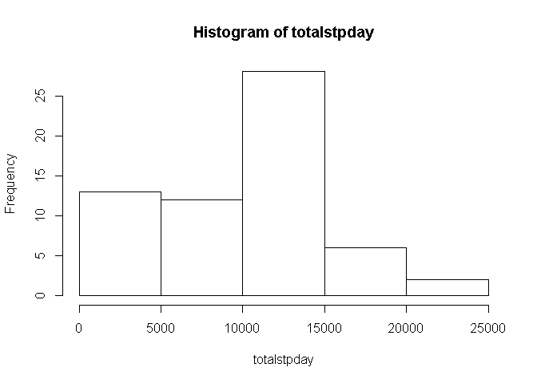
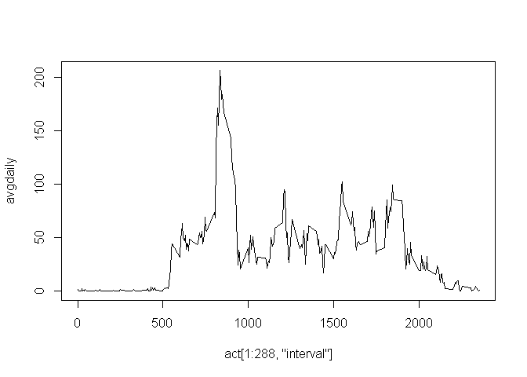

# Reproducible Research: Peer Assessment 1


## Loading and preprocessing the data


```r
unzip("activity.zip")
act<-read.csv("activity.csv")
```

## What is mean total number of steps taken per day?


```r
totalstpday<-tapply(X = act$steps,INDEX = act$date, FUN = sum, na.rm = TRUE)
hist(totalstpday)
```

 

```r
mean(totalstpday)
```

```
## [1] 9354.23
```

```r
median(totalstpday)
```

```
## [1] 10395
```

## What is the average daily activity pattern?

```r
avgdaily<-tapply(act$steps, act$interval, mean, na.rm = TRUE)
plot(act[1:288,"interval"], avgdaily, type = "l")
```

 

```r
avgdaily[avgdaily == max(avgdaily)]
```

```
##      835 
## 206.1698
```

## Imputing missing values


## Are there differences in activity patterns between weekdays and weekends?
